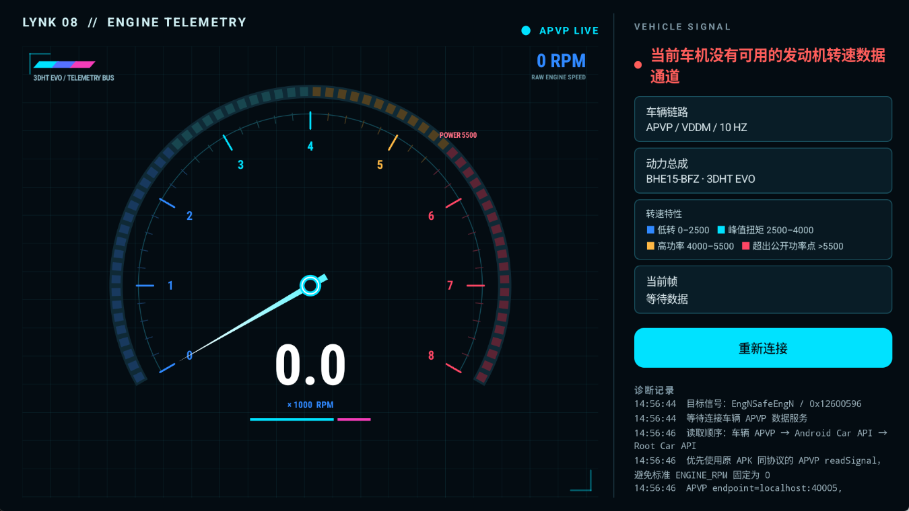

<div align="center">
  
  <h1>LynkRPMReader</h1>
  <p>面向 Android Automotive 车机的开源发动机转速仪表</p>

  [](https://github.com/zyli-developer/lynk-rpm-reader/actions/workflows/android.yml)
  [](LICENSE)
  
  
</div>

> [!IMPORTANT]
> 当前版本仅在 **2023 款和 2025 款领克 08**、**Flyme Auto 2.0.0** 系统上完成适配验证。其他车型、年款和系统版本尚未验证。

## 🚗 项目简介

LynkRPMReader 在车机横屏上实时显示发动机转速，并提供启动扫表动画。应用优先读取兼容车机提供的本地 APVP 信号，在不可用时依次尝试标准 Android Car API 和可选的 Root Car API 通道。

当前源码包名为 `com.lynk.rpmreader`，版本为 `1.7.3`（`versionCode 14`）。

本项目为非官方社区项目，与领克、吉利、魅族及其关联公司无隶属、授权或背书关系。品牌及产品名称仅用于如实说明已验证的设备兼容性。

## 🖼️ 应用界面

<div align="center">
  
  <p><sub>LynkRPMReader 实际车机运行界面</sub></p>
</div>

## ✅ 已验证兼容性

| 车型 | 年款 | 车机系统 | 验证状态 |
| --- | --- | --- | --- |
| 领克 08 | 2023 款 | Flyme Auto 2.0.0 | ✅ 已验证 |
| 领克 08 | 2025 款 | Flyme Auto 2.0.0 | ✅ 已验证 |

应用不依赖特定 CPU。兼容性取决于车辆信号、本地服务和系统权限，请勿仅根据座舱芯片判断是否兼容。

## ✨ 功能亮点

- 📈 横屏实时转速仪表
- 🚀 一次性启动动画与自检扫表
- 🔌 兼容车机 APVP 本地 gRPC 转速读取
- 🚘 标准 Android Automotive `ENGINE_RPM` 后备通道
- 🔐 可选 Root Car API 后备通道
- 🧪 JVM 零依赖协议与仪表逻辑测试
- 🏠 数据仅在车机本地处理，不连接外部业务服务器

## 📱 系统要求

- Android 9（API 28）或更高版本
- 兼容的车机本地服务或 Android Automotive 车辆属性权限
- 可选 Root 后备通道只会连接 `127.0.0.1:38605` 上的本机辅助服务；APK 不会自动申请 Root 权限或启动该服务

普通 Android 手机可以安装和启动，但通常没有车辆数据服务，因此不会显示真实转速。请勿在驾驶过程中安装、调试或操作本应用。

## 🛠️ 构建与测试

需要 JDK 17 和包含 Android 34 平台的 Android SDK。项目源码兼容级别为 Java 8，JDK 17 用于运行当前 Android Gradle Plugin。

构建前需让 Gradle 能够找到 Android SDK。可以通过 Android Studio 生成仓库根目录下的 `local.properties`，也可以在当前终端设置 `ANDROID_HOME`。

Windows PowerShell 的常见配置：

```powershell
$env:ANDROID_HOME = "$env:LOCALAPPDATA\Android\Sdk"
```

Linux 的常见配置：

```bash
export ANDROID_HOME="$HOME/Android/Sdk"
```

macOS 的常见配置：

```bash
export ANDROID_HOME="$HOME/Library/Android/sdk"
```

Windows：

```powershell
.\gradlew.bat :rpmreader:rpmLogicTest :rpmreader:assembleDebug
```

Linux / macOS：

```bash
./gradlew :rpmreader:rpmLogicTest :rpmreader:assembleDebug
```

构建成功后，APK 位于：

```text
rpmreader/build/outputs/apk/debug/rpmreader-debug.apk
```

Debug APK 仅用于测试。Release 构建默认不包含发布签名，请在本地或私有 CI 中配置自己的签名材料，切勿提交密钥、证书密码或 `local.properties`。

## 🔄 数据读取顺序

```text
APVP local gRPC → Android Car API → Root Car API
```

APVP 兼容层仅连接车机本机回环地址，不连接互联网。实现中的接口名称与信号标识只用于设备互操作。

## 🛡️ 安全、隐私与兼容性

- 应用只读取发动机转速及其状态，不发送车辆控制指令。
- 不采集 VIN、位置、音视频、账号或其他车辆控制数据。
- 转速只在设备内存和系统日志中处理，不上传到外部服务器。
- `INTERNET` 权限只用于连接车机本机回环地址上的 APVP 服务（`localhost:40005/40007`）和可选 Root 辅助服务（`127.0.0.1:38605`）。
- 只能在本人所有或获得明确授权的车辆与车机上使用，不得绕过访问控制或获取无权访问的数据。
- 车机固件升级后，本地接口可能发生变化。
- Root 辅助服务以更高权限运行，会扩大整体安全风险面；不了解风险时请勿启用。
- 不保证兼容所有车型、地区版本或车机固件。
- 仓库只包含项目原创代码及按各自许可证使用的第三方依赖，不包含无权分发的第三方内容。

更多信息：

- [隐私说明](PRIVACY.md)
- [开发与来源说明](PROVENANCE.md)
- [法律与使用边界](LEGAL_NOTICE.md)
- [安全策略](SECURITY.md)
- [第三方依赖说明](THIRD_PARTY_NOTICES.md)

## 🤝 参与贡献

欢迎提交 Issue 和 Pull Request。贡献前请阅读 [CONTRIBUTING.md](CONTRIBUTING.md)，并确保新增代码、依赖和资源具有清晰的来源与授权。

## 📄 许可证

项目原创代码以 [Apache License 2.0](LICENSE) 发布。第三方组件继续适用各自的许可证；Apache-2.0 不授予任何第三方商标使用权。
