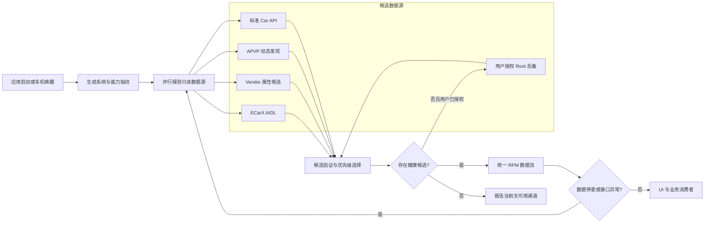

# 车机跨版本转速数据源自适应方案

> 状态：第一阶段 APVP 动态发现已实施并通过单元测试、实车验证；第二至第四阶段仍为后续规划。
> 日期：2026-08-27
> 适用项目：`lynk-rpm-reader`
> 目标：车机升级后优先通过运行时发现继续读取发动机转速，避免因 APVP 信号 ID 或厂商属性 ID 变化而重新发布 APK。

## 关键结论

实施前的跨版本问题不是“读取了内存地址”，而是把 APVP 信号 ID 当成稳定常量使用：旧代码能够通过名称发现 `EngNSafeEngN` 所在的 transfer，却没有保存配置返回的真实信号 ID，最终仍使用固定的 `0x12600596` 发起读取。

第一阶段改造已经修复这一根因。当前代码会从 `SignalConfig` 解码并保存完整的 `(signalId, signalName)`，使用运行时发现的身份发起读取，并将响应校验绑定到同一次发现结果。目标车机已经验证动态发现并读取 `0x12600597`，因此 APVP 主路径不再依赖按 Flyme/OTA 版本增加转速 ID 常量。

完整目标方案仍是把数据源选择改为运行时能力探测：

1. 标准 Car API、APVP、厂商属性通道分别报告当前固件实际支持的能力。
2. APVP 按语义名称发现 `EngNSafeEngN`，保存车机返回的真实 `(signalId, signalName)`。
3. 优先使用流式订阅，接口不支持时降级到 `readSignal` 轮询。
4. 对所有候选数据源执行权限、首帧、时间戳、类型和状态检查后再选主通道。
5. 系统指纹或能力摘要改变时自动废弃缓存并重新发现。

其中 APVP 按名称发现并使用真实 ID 的第一阶段已经完成；流式订阅、统一多源选择以及版本指纹缓存仍待实施。完整方案能够覆盖“ID 改变、transfer 改变、标准属性可用性改变、流式接口能力改变”等常见升级差异，但不能保证覆盖厂商彻底删除 APVP、改变 protobuf 字段语义、关闭本地服务或加强第三方应用权限隔离等破坏性升级。

## 范围与约束

### 本文范围

- 分析 `lynk-rpm-reader` 实施前的 APVP、标准 Car API 和 Root 后备路径，并记录第一阶段修复结果。
- 对照参考 APK 的 APVP 配置发现、订阅和厂商 AIDL 实现。
- 使用既有车机只读备份验证端口、权限、服务访问和实车运行结果。
- 给出剩余阶段的模块边界、运行流程、失效策略和测试矩阵。

### 不在本文范围内

- 本次已实施的代码改造仅覆盖 APVP 动态身份发现；流式订阅、统一多源监督器和版本指纹画像尚未实现。
- 不执行车辆属性写入，不控制油门、挡位、车门、灯光或其他执行器。
- 不把 Root、SELinux permissive 或系统签名视为普通用户安装环境的必要条件。
- 不保证跨越厂商完全不同的车辆平台或被移除的私有协议。

### 安全边界

- 生产逻辑只读取经过明确识别的发动机转速信号。
- 不自动遍历并导出全部车辆实时数据。
- Root 只能由用户明确授权，且只作为最后后备。
- 发动机状态变化测试必须由用户在安全停车条件下手动完成。

相关采集顺序和隐私边界见[车机数据定向采集与 RPM APK 完善计划](./2026-08-27_plan-headunit-data-collection-report.md)。

## 已验证基线

| 项目 | 当前车机观察 | 对跨版本设计的意义 |
| --- | --- | --- |
| APVP 转速信号 | 历史配置为 `308282774 / 0x12600596`；目标车机当前返回 `308282775 / 0x12600597`；名称均为 `EngNSafeEngN` | 实车差异证明名称和类型比数字 ID 更适合作为语义锚点 |
| APVP 数据服务 | `127.0.0.1:40005` 正在监听 | 当前普通 APK 可走本地 gRPC 读取路径 |
| APVP 调试服务 | `127.0.0.1:40007` 正在监听 | 可以运行时枚举 transfer 和信号配置 |
| 实车运行 | 动态发现 `0x12600597` 并成功执行 `setReady transfer(268435456)`；随后读到连续非零转速并最终回到 `0.0` | APVP 发现、激活、读取闭环和转速变化均已验证；0 rpm 是合法状态 |
| 标准 Car API | `ENGINE_RPM = 291504901 / 0x11600305` | 应保留为标准兼容路径 |
| 标准属性权限 | `CAR_ENGINE_DETAILED` 为 `signature\|privileged` | 当前侧载 APK 不能依赖该权限 |
| RPM Reader 权限 | 已授予 `CAR_POWERTRAIN`，未授予 `CAR_ENGINE_DETAILED` | Manifest 声明不等于获得标准转速属性权限 |
| ECarX AIDL | EVCC 查询 `ecarxcar_service` 时产生 SELinux `find` 拒绝，系统当时为 permissive | 只能做可选能力探测，不能作为长期主通道 |

历史备份验证了 `0x12600596`，目标车机的当前配置和运行日志验证了 `0x12600597`。这组差异证明数字 ID 会随版本变化。当前代码保留两个已知 ID 只用于名称缺失时的旧协议兼容；正常主路径按 `EngNSafeEngN` 名称接受配置返回的任意正 ID，不应继续增加版本 ID 常量。

## 实施前根因与当前修复

### 实施前流程

实施前的 APVP 读取流程如下：

1. 连接 `localhost:40007`。
2. 调用 `getAllTransfer` 获取 transfer 列表。
3. 对每个 transfer 调用 `getTransferSignalConfig`。
4. 使用“ID 相同或名称为 `EngNSafeEngN`”判断是否匹配。
5. 只保存匹配到的 `transferId` 并执行 `setReady`。
6. 构造读取请求时仍固定使用 `ENGINE_RPM_ID = 308282774`。

根因位于第 4 至第 6 步之间：配置中真实存在的 `SignalIdentify` 被降级成布尔判断，真实 ID 没有进入后续读取请求。

旧版 `isEngineRpmReading()` 还只接受两个已知 ID，因此服务器返回第三个合法 ID 时会被当成异常。

### 当前流程

当前实现已经改为：

1. 枚举 transfer 并解码每项配置中的完整 `SignalIdentity(id, name)`。
2. 名称精确等于 `EngNSafeEngN` 时接受配置返回的任意正 ID；只有名称缺失时才使用两个已知 ID 作为兼容后备。
3. 激活流程同时保存 `transferId` 和本次发现的 `SignalIdentity`。
4. 使用该身份的真实 ID 和名称构造读取请求。
5. 使用同一身份校验响应；响应携带非空 ID 或名称时必须与发现结果一致。

因此第一阶段已经消除“发现新 ID、读取旧 ID”的版本耦合。剩余风险属于后续阶段，例如 APVP 接口被删除、字段语义发生破坏性变化，或读取权限被进一步收紧。

## 目标架构



图中“并行探测”表示逻辑上同时评估能力，不要求所有网络和 Binder 调用真的并发执行。实现时可以设置总时间预算并按短超时依次执行，以避免启动阶段造成资源竞争。

### 模块职责

| 模块 | 职责 | 不应承担的职责 |
| --- | --- | --- |
| `VehicleSignalResolver` | 汇总能力、解析语义信号、选择候选 | 不直接更新 UI |
| `ApvpCapabilityProbe` | 枚举 transfer 和完整 `SignalConfig` | 不写死某个固件的信号 ID |
| `CarApiCapabilityProbe` | 枚举标准和可见 vendor 属性、验证权限 | 不假设属性出现在列表就一定可读 |
| `ECarxCapabilityProbe` | 检查 Binder 服务和单个候选属性是否可注册 | 不依赖 permissive SELinux |
| `RpmSourceSupervisor` | 管理首帧、健康状态、切换和重试 | 不把合法的 0 rpm 当成故障 |
| `SignalProfileStore` | 保存语义名称、候选 ID、类型和来源约束 | 不允许未经校验的远程配置直接控制写属性 |
| `RpmStream` | 向 UI 提供统一的值、状态、来源和时间戳 | 不暴露 APVP/VHAL 私有对象 |

### 统一解析结果

后续实现应让各数据源返回统一的解析结果，而不是立即开始永久读取：

```text
ResolvedRpmSignal
  source              APVP | CAR_API | ECARX_AIDL | ROOT
  semanticRole        engine_rpm
  transportEndpoint   可为空
  transferId          仅 APVP 使用
  signalOrPropertyId  运行时发现或验证后的真实 ID
  signalName          车机返回的名称或标准名称
  valueType           Float | Int32 | 其他明确类型
  areaId              默认 0，但以配置为准
  access              read-only 或可读属性
  discoveryFingerprint
  confidence
```

`signalOrPropertyId` 只是发现结果，不再是决定车型版本的输入。

## 运行时解析顺序

### 建立版本与能力指纹

缓存键建议至少包含：

- `Build.FINGERPRINT`
- 系统增量版本或可读取的 OTA 版本
- Android SDK 版本
- APVP 可用方法集合
- APVP 发现到的目标信号配置摘要

应用升级不是清除缓存的唯一条件。只要车机指纹或 APVP 配置摘要变化，就重新发现信号。缓存只用于缩短启动时间，使用前仍要进行轻量验证。

参考 APK 已采用“应用版本 + OTA 版本”生成 AIDL 映射指纹，并在指纹变化时清理无效属性缓存。这一模式可以复用，但不能照搬其中依赖私有 `NativeBridge` 的部分。

### 探测标准 Car API

1. 创建 `android.car.Car`。
2. 获取 `CarPropertyManager`。
3. 调用 `getPropertyList()`，确认标准 `ENGINE_RPM` 是否出现。
4. 同时检查受控的 vendor 候选 ID，但不遍历读取所有属性。
5. 对候选执行一次真实只读调用或监听注册。
6. 记录成功、权限拒绝、属性不存在和类型不匹配等不同结果。

优先级规则是“标准接口实际可用时优先”，而不是“标准 ID 永远优先”。当前车机即使能获取 `CarPropertyManager`，仍可能因 `CAR_ENGINE_DETAILED` 无法读取 `ENGINE_RPM`。

### 动态解析 APVP 信号

APVP 是当前平台最有价值的跨版本路径，推荐流程如下：

1. 以短超时连接 `127.0.0.1:40007`。
2. 调用 `TransferDebugServer/getAllTransfer`。
3. 对每个 transfer 调用 `getTransferSignalConfig`。
4. 解码完整 `SignalConfig`，不得只返回匹配布尔值。
5. 对候选进行语义和结构校验。
6. 保存配置返回的真实 `SignalIdentify(id, name)`。
7. 对目标 transfer 调用 `setReady`。
8. 使用真实 `(id, name)` 调用 `listenerSignalStream`。
9. 如果服务器返回 `UNIMPLEMENTED`、流在限定时间内没有首帧或协议不兼容，降级到 `readSignal`。

推荐的 APVP 匹配条件：

| 条件 | 要求 | 原因 |
| --- | --- | --- |
| 名称 | 首选精确匹配 `EngNSafeEngN` | 防止误选车轮、电机或目标怠速信号 |
| 访问方式 | `readOnly=true` | 当前功能只需要读取 |
| 类型 | 首选 Float，允许经过验证的 Int32 | 已知 APVP 配置为 Float，其他后端可能使用 Int32 |
| 模块 | 当前基线为 `VDDM`，作为加分条件而非绝对常量 | 模块归属可能随架构调整 |
| 描述 | 可辅助匹配“发动机转速/engine speed” | 仅作为辅助，不能单独决定 |
| ID | 接受配置返回的真实值 | ID 是发现结果，不是版本判断条件 |

如果名称不存在但只有近似候选，不应静默选择。应记录候选配置并转入受控兼容画像或人工确认流程。

### 探测厂商属性和 ECarX AIDL

已知候选包括：

- 标准 AAOS：`291504901 / 0x11600305 / ENGINE_RPM`
- 领克/吉利 vendor VHAL 候选：`557875302 / 0x21408066 / 发动机转速`
- 参考映射中的 `557884293 / VEH_ENGNSAFEENGN`

后两个数字只能作为候选，不能直接提升为跨版本常量。必须先确认属性被当前服务暴露、类型正确、注册或读取成功，并且实车变化符合发动机转速语义。

ECarX AIDL 的探测步骤应当是：

1. 查询 `ecarxcar_service`。
2. 获取 `car_signal` Binder。
3. 为有限的受控候选构造 `SignalFilter`。
4. 尝试批量注册；失败时允许逐个候选验证。
5. 遇到服务不可见、SELinux 拒绝或注册异常时立即标记不可用，不尝试绕过系统隔离。

### 选择主数据源

候选必须同时满足以下条件才可进入主数据流：

- 配置或属性真实存在。
- 当前应用身份具有读取权限。
- 在限定时间内获得首帧或明确的可用状态。
- 值类型与配置一致。
- 值是有限数值且处于合理物理范围。
- 后续时间戳或回调持续推进。
- 信号语义置信度足够高。

满足条件后的建议优先级：

1. 实际可读的标准 `ENGINE_RPM`。
2. 按精确名称动态发现的 APVP 信号。
3. 经配置和实车行为验证的 vendor Car 属性。
4. 当前身份可以稳定访问的 ECarX AIDL。
5. 用户明确授权的 Root Car API。

在当前车机上，标准属性受权限限制，因此 APVP 预计会自然成为第一可用候选。

## 数据健康与自动切换

### 不把 0 rpm 当作失败

`0 rpm` 在发动机熄火、纯电驱动或混合动力发动机停机时是合法值。实车日志已经出现 APVP 正常连接且返回 `0.0 rpm` 的情况。

数据源故障应由以下信号判断：

- gRPC/Binder 明确错误。
- 属性状态为不可用或错误。
- 订阅超时且没有任何首帧。
- 时间戳长期不推进。
- 返回 NaN、Infinity、负值或明显不合理的高值。
- 响应身份与当前解析到的信号不一致。

### 切换规则

- 单次超时不立即永久切换，先进行有限次数重试。
- 持续失败后切换到下一个已经验证的候选。
- 切换后保留原通道的低频恢复探测。
- 车机休眠或 Binder death 后重新建立能力快照。
- 系统版本变化后不复用旧的失败黑名单。
- UI 同时显示数据来源和连接状态，便于后续实车诊断。

## 可独立更新的兼容画像

运行时发现可以解决 ID 变化，但无法解决厂商同时修改名称的情况。建议把少量语义别名和 vendor 候选放入只读兼容画像，画像与 APK 读取引擎解耦。

概念结构如下：

```json
{
  "schemaVersion": 1,
  "role": "engine_rpm",
  "apvp": {
    "exactNames": ["EngNSafeEngN"],
    "expectedTypes": ["float", "int32"],
    "preferredModules": ["VDDM"]
  },
  "carApi": {
    "standardIds": [291504901],
    "vendorCandidates": [557875302]
  },
  "vendorCandidates": [
    {"id": 557884293, "name": "VEH_ENGNSAFEENGN"}
  ],
  "validation": {
    "minimum": 0,
    "maximum": 10000,
    "areaId": 0
  }
}
```

该文件只是候选约束，不代表其中所有 ID 都能读取。每个候选仍必须经过运行时验证。

如果未来允许独立分发画像，应满足：

- 画像有固定 schema 版本。
- 远程画像必须验签。
- 只允许只读信号角色，不能携带写属性操作。
- 更新失败时继续使用 APK 内置的最后可信画像。
- 记录画像版本和最终解析结果，便于回滚和诊断。

## 协议兼容策略

| 变化类型 | 自动兼容方式 | 是否需要 APK 更新 |
| --- | --- | --- |
| `signalId` 改变，名称和 protobuf 结构不变 | 重新枚举并使用真实 ID | 通常不需要 |
| transfer ID 改变 | `getAllTransfer` 后重新匹配 | 不需要 |
| 流式方法不可用 | `listenerSignalStream` 降级为 `readSignal` | 通常不需要 |
| 标准属性开始可用 | 能力探测自动提升标准 Car API | 不需要 |
| 标准属性权限被收紧 | 自动转用已验证 APVP/vendor 路径 | 不需要 |
| 名称改变但画像已提供别名 | 使用新画像重新发现 | 不需要重新发布 APK |
| APVP 端口改变 | 仅尝试明确配置的候选端口，不进行全端口扫描 | 可能只需画像更新 |
| protobuf 字段号或消息语义破坏性改变 | 旧解码器无法可靠解析 | 通常需要 APK 更新 |
| APVP 被删除且其他通道均受限 | 无可用普通应用通道 | 需要厂商支持、系统身份或新方案 |
| SELinux 从 permissive 改为 enforcing | 放弃被拒绝的 ECarX AIDL 路径 | APVP/标准通道可用时不需要 |

## 实施计划

### 第一阶段：修正 APVP 动态发现（已完成）

1. `decodeSignalConfigIdentity()` 保留配置中的完整信号身份。
2. transfer 激活流程返回同时包含 `transferId` 和 `SignalIdentity` 的 `Target`。
3. 读取请求使用解析到的真实 ID 和名称。
4. 响应校验绑定到本次解析结果，不再绑定两个版本常量。
5. 单元测试覆盖第三个模拟 ID、响应身份匹配和不匹配场景；实车验证覆盖 `0x12600597` 的非零转速到 0 的变化。

完成结果：修改测试数据中的 APVP ID 而不修改应用常量时，新身份能够被解析、保留并用于响应校验；目标车机也已使用运行时发现的 `0x12600597` 完成读取。

### 第二阶段：流式订阅和健康管理（计划中）

1. 实现 `listenerSignalStream`。
2. 保留 `readSignal` 作为能力降级路径。
3. 增加首帧超时、流停滞、Binder/gRPC 重连和来源状态。
4. 保证发动机停止时的稳定 0 值不会触发错误切换。

完成条件：流式接口可用时不再以 100 ms 周期持续发起 unary 请求；流式接口不可用时仍能自动读取。

### 第三阶段：多源能力选择（计划中）

1. 标准 Car API 先枚举配置再尝试读取。
2. 将 vendor 属性和 ECarX AIDL 封装成独立探测器。
3. 引入统一候选验证与 `RpmSourceSupervisor`。
4. Root 保持用户授权的最后后备，不自动提权。

完成条件：任一数据源不可用不会阻塞其他数据源探测，来源切换原因可以从日志复现。

### 第四阶段：版本指纹和兼容画像（计划中）

1. 保存系统与能力指纹。
2. 指纹变化后自动清除解析缓存和无效候选缓存。
3. 引入有 schema 的内置画像。
4. 如确有需要，再增加经过签名验证的独立画像更新。

完成条件：模拟 OTA 指纹变化后应用重新发现信号，而不是继续使用旧 ID。

## 测试矩阵

| 场景 | 预期结果 | 关键断言 |
| --- | --- | --- |
| 当前固件、发动机停止 | APVP 返回 0，通道保持健康 | 0 不触发切换 |
| 当前固件、发动机运行 | RPM 随实际状态变化 | 数值、状态、时间戳有效 |
| APVP ID 改成第三个测试值 | 自动使用配置返回的新 ID | 代码中不新增 ID 常量 |
| transfer ID 改变 | 重新枚举并激活新 transfer | 不依赖 `268435456` |
| `listenerSignalStream` 返回 `UNIMPLEMENTED` | 自动使用 `readSignal` | UI 不丢失数据 |
| APVP 40007 不可用但缓存存在 | 缓存轻量验证失败后尝试其他通道 | 不无限使用过期缓存 |
| 标准 `ENGINE_RPM` 可读 | 选择标准 Car API | APVP 作为热后备或恢复探测 |
| 标准属性权限拒绝 | 记录权限原因并使用 APVP | 不进入 Root，除非用户授权 |
| ECarX Binder 被 SELinux 拒绝 | 标记 AIDL 不可用 | 不尝试绕过策略 |
| 车机休眠后唤醒 | 重新连接并恢复数据 | 无永久僵死线程或旧 Binder |
| OTA 指纹改变 | 清除解析缓存并重新发现 | 不发送旧 ID |
| 信号名称出现多个近似候选 | 拒绝静默猜测 | 输出候选诊断信息 |

## 日志与诊断要求

生产日志至少应包含：

- 系统与能力指纹摘要，不记录 VIN、账号或个人数据。
- 每个数据源的探测结果和失败分类。
- APVP 匹配到的 transfer、ID、名称、类型和模块。
- 最终选中的数据源及选择原因。
- 数据源切换的时间、旧来源、新来源和错误类型。
- 缓存命中、失效和重新发现原因。

不应持续逐帧记录 RPM。数值日志应限速，或者只在调试构建中启用。

## 风险与剩余边界

| 风险 | 影响 | 缓解措施 |
| --- | --- | --- |
| APVP 是厂商私有协议 | 可能发生无兼容承诺的破坏性变化 | 多数据源探测、能力降级、保留画像更新能力 |
| 名称语义改变 | 无法仅靠旧名称发现 | 受控别名画像和人工确认，不做宽泛 `RPM` 匹配 |
| 标准权限长期不可授予侧载 APK | 标准接口无法成为当前主路径 | 继续使用普通应用可访问的只读 APVP |
| ECarX 服务访问依赖 permissive | OTA enforcing 后可能失效 | 仅作低优先级候选 |
| vendor ID 缺少稳定语义元数据 | 可能误认其他转速 | 配置、类型、状态和实车行为联合验证 |
| 错误地把 0 当故障 | 混动车型频繁切换数据源 | 将 0 视为合法值，依赖状态和时间戳判断健康 |
| 远程画像被篡改 | 可能选择错误车辆信号 | 固定 schema、数字签名、只读角色白名单 |

## Evidence

以下结论来自仓库源码和经授权取得的只读车机证据。公共仓库只保留可复现步骤和脱敏结论；原始日志、设备清单、反编译产物及其哈希保存在私有证据归档中，不随仓库提交。

### E-001 当前读取请求使用运行时发现的 APVP 身份

- `source_type`: file
- `source_ref`: [`ApvpGrpcRpmClient.java`](../rpmreader/src/main/java/com/lynk/rpmreader/ApvpGrpcRpmClient.java#L65)、[`ApvpSignalCodec.java`](../rpmreader/src/main/java/com/lynk/rpmreader/ApvpSignalCodec.java#L146)
- `content_hash`:
  - `ApvpGrpcRpmClient.java`: `D41C031E93E6CA9CF49B84A687EB11BBB2A42F689E61DA6EB6CFC2C958B1D30E`
  - `ApvpSignalCodec.java`: `80A6891C70B35C4516AB1F67820D2985F99AB66B366168D1AEC6D858B4C44D8C`
- `repro_command`:

```powershell
rg -n "Target target|target.identity|decodeSignalConfigIdentity|isEngineRpmConfig|isEngineRpmReading" `
  "rpmreader\src\main\java\com\lynk\rpmreader\ApvpGrpcRpmClient.java" `
  "rpmreader\src\main\java\com\lynk\rpmreader\ApvpSignalCodec.java"
```

- `raw_excerpt`: 激活流程返回动态发现的 `Target`；读取请求使用 `target.identity.id/name`，响应校验也绑定 `target.identity`。

### E-002 历史车机 APVP 配置包含名称、真实 ID 和类型信息

- `source_type`: file
- `source_ref`: `dx11_cn_apvp_signal_config.json`（私有证据归档，未提交）
- `content_hash`: 记录于私有证据清单
- `repro_command`:

```powershell
rg -n -A 8 '"name": "EngNSafeEngN"' `
  "<private-config>\dx11_cn_apvp_signal_config.json"
```

- `raw_excerpt`: 历史配置中 `EngNSafeEngN` 的值为 `308282774 / 0x12600596`，模块为 `VDDM`，只读，值类型为 Float。

### E-003 参考 APK 提供完整发现和流式读取协议

- `source_type`: file
- `source_ref`: `C1774u.java`（私有参考 APK 反编译归档，未提交）
- `content_hash`: 记录于私有证据清单
- `repro_command`:

```powershell
rg -n "getAllTransfer|getTransferSignalConfig|setReady|readSignal|listenerSignalStream" `
  "<private-reference-source>\C1774u.java"
```

- `raw_excerpt`: 存在 `getAllTransfer`、`getTransferSignalConfig`、`setReady`、`readSignal` 和 `listenerSignalStream`。

### E-004 参考 APK 会解码真实 SignalIdentify 并用于订阅

- `source_type`: file
- `source_ref`: `nk3.java`、`C0059bf.java`（私有参考 APK 反编译归档，未提交）
- `content_hash`: 记录于私有证据清单
- `repro_command`:

```powershell
rg -n "m632l1|m633lI|new C0706me|m638ll|new be4" `
  "<private-reference-source>\nk3.java" `
  "<private-reference-source>\C0059bf.java"
```

- `raw_excerpt`: 配置解码保留 ID 和名称，订阅请求从配置映射中取回名称。

### E-005 目标车机动态 APVP 读取闭环已成立

- `source_type`: log
- `source_ref`: `sockets.txt`、`logcat_all.txt`（私有只读采集归档，未提交）
- `content_hash`: 记录于私有证据清单
- `repro_command`:

```powershell
rg -n "40005|40007" `
  "<private-capture>\inventory\sockets.txt"
rg -n "setReady transfer|APVP EngNSafeEngN" `
  "<private-capture>\inventory\logcat_all.txt"
```

- `raw_excerpt`: 40005/40007 在 loopback 监听；配置返回 `EngNSafeEngN=308282775 / 0x12600597`；`setReady transfer(268435456)` 成功；应用随后读到连续非零转速并最终回到 `0.0 rpm`。

### E-006 标准转速属性受特权权限限制

- `source_type`: file
- `source_ref`: `dumpsys_package.txt`（私有只读采集归档，未提交）
- `content_hash`: 记录于私有证据清单
- `repro_command`:

```powershell
rg -n -C 4 "CAR_ENGINE_DETAILED|Package \[com\.lynk\.rpmreader\]" `
  "<private-capture>\inventory\dumpsys_package.txt"
```

- `raw_excerpt`: `CAR_ENGINE_DETAILED` 为 `signature|privileged`；RPM Reader 只获得 `CAR_POWERTRAIN`。

### E-007 ECarX AIDL 存在 SELinux 可访问性风险

- `source_type`: log
- `source_ref`: `logcat_all.txt`（私有只读采集归档，未提交）
- `content_hash`: 记录于私有证据清单
- `repro_command`:

```powershell
rg -n "name=ecarxcar_service" `
  "<private-capture>\inventory\logcat_all.txt"
```

- `raw_excerpt`: UID 10155、`untrusted_app` 查询 `ecarxcar_service` 时产生 `{ find }` 拒绝，日志标记 `permissive=1`。

## Findings

### F-001 APVP 固定 ID 版本耦合已经修复

- `severity`: n/a_re
- `category`: design
- `status`: remediated
- `evidence_ids`: E-001, E-002
- `location`: `ApvpGrpcRpmClient.activateTransfer()`、`ApvpSignalCodec.decodeSignalConfigIdentity()` 与 `isEngineRpmReading(reading, expected)`
- `impact`: 实施前在信号名称不变但 ID 改变时，APK 可能向旧 ID 发起请求；当前主路径使用配置返回的真实身份。
- `confidence`: high
- `remediation`: 已完成——解析并保存完整 `SignalIdentify`，读取请求和响应校验均使用实际身份；第三个模拟 ID 和实车 `0x12600597` 已验证。

### F-002 APVP 已具备不依赖固定 ID 的协议条件

- `severity`: n/a_re
- `category`: reverse_algo
- `status`: validated
- `evidence_ids`: E-003, E-004, E-005
- `location`: APVP debug/read gRPC 接口与参考 APK 配置映射
- `impact`: 可以在应用启动时按名称重新定位转速信号，并使用流式订阅。
- `confidence`: high
- `remediation`: n/a

### F-003 标准 Car API 应保留，但当前不能作为唯一方案

- `severity`: n/a_re
- `category`: design
- `status`: validated
- `evidence_ids`: E-006
- `location`: Android Car permission 与 RPM Reader 安装权限
- `impact`: 仅依赖标准 `ENGINE_RPM` 会在当前侧载身份下失败。
- `confidence`: high
- `remediation`: 运行时探测标准属性，失败后使用已验证的 APVP/vendor 路径。

### F-004 ECarX AIDL 不适合作为跨版本主通道

- `severity`: n/a_re
- `category`: design
- `status`: validated
- `evidence_ids`: E-007
- `location`: `ServiceManager.getService("ecarxcar_service")`
- `impact`: 固件启用 enforcing 后，当前 permissive 环境下看似可用的访问可能被阻断。
- `confidence`: high
- `remediation`: 仅作可选能力探测，不绕过 SELinux。

### F-005 多源能力探测可显著减少 APK 随 OTA 更新

- `severity`: n/a_re
- `category`: design
- `status`: validated
- `evidence_ids`: E-002, E-003, E-004, E-005, E-006, E-007
- `location`: 目标架构
- `impact`: ID、transfer 和接口可用性变化可在运行时吸收；破坏性协议或权限变化仍有剩余风险。
- `confidence`: high
- `remediation`: 第一阶段已经完成；继续实施第二至第四阶段，并用测试矩阵验证流式健康管理、多源切换和版本指纹失效。

## Path

### P-001 跨版本 RPM 解析调用路径

- `path_type`: callflow
- `start`: APK 启动、车机唤醒或系统指纹变化
- `goal`: 输出经过语义和健康验证的统一 RPM 数据流
- `steps`:
  1. 生成版本与能力指纹；关联 F-005。
  2. 调用 APVP `getAllTransfer` 和 `getTransferSignalConfig`；证据 E-003。
  3. 从完整配置提取 `SignalIdentify`、类型、模块和访问方式；证据 E-002、E-004。
  4. 使用真实 transfer 和信号身份执行 `setReady`；证据 E-005。
  5. 优先建立 `listenerSignalStream`，不支持时使用 `readSignal`；证据 E-003。
  6. 同时评估标准 Car API 和有限 vendor/AIDL 候选；证据 E-006、E-007。
  7. 根据首帧、状态、时间戳、类型和语义置信度选择数据源；关联 F-003、F-004、F-005。
  8. 数据源停更或系统指纹改变时返回第 1 步。
- `residual_risks`: APVP 协议被删除或破坏性修改、所有普通应用通道均被权限隔离时，无法仅靠本架构保证读取。

## Timeline 摘要

| 日期 | 记录 |
| --- | --- |
| 2026-08-27 | 完成车机只读 inventory、权限、端口和日志整理。 |
| 2026-08-27 | 验证 RPM Reader 通过 APVP 成功执行 `setReady` 并读取 `EngNSafeEngN`。 |
| 2026-08-27 | 对照参考 APK，还原 APVP 配置枚举、真实身份解码和流式订阅能力。 |
| 2026-08-27 | 确认实施前代码动态发现后仍发送固定 ID，形成跨版本根因。 |
| 2026-08-27 | 完成运行时能力探测、多源后备、缓存失效和兼容画像方案。 |
| 2026-08-27 | 完成第一阶段改造：保存动态 `SignalIdentity`，读取请求和响应校验绑定实际身份。 |
| 2026-08-27 | 通过第三个模拟 ID 单元测试，并在目标车机验证动态 `0x12600597` 的非零转速到 0 的变化。 |

## 验收状态

第一阶段已经满足：

- [x] APVP 主路径不再需要按 Flyme/OTA 版本增加 RPM ID 分支。
- [x] 第三个模拟 ID 可以按名称解析并保留，响应使用同一次发现的身份校验。
- [x] transfer 通过运行时枚举获得，不依赖固定的 `268435456`。
- [x] 实车使用动态发现的 `0x12600597` 读到非零转速并最终回到合法的 0 rpm。
- [x] 日志记录发现的 transfer、信号 ID 和名称，不记录原始设备标识或个人数据。

完整目标架构仍需满足：

- [ ] 标准 Car API 可用时能被自动选择，不可用时不会阻塞 APVP。
- [ ] 流式接口不可用时自动降级为轮询。
- [ ] OTA 指纹改变后自动重新发现，不复用旧映射。
- [ ] ECarX AIDL 被拒绝时安全退出该候选，不绕过系统权限。
- [ ] Root 只在用户明确授权后启用。
- [ ] 日志能够解释多数据源“发现了什么、选择了什么、为什么切换”。
