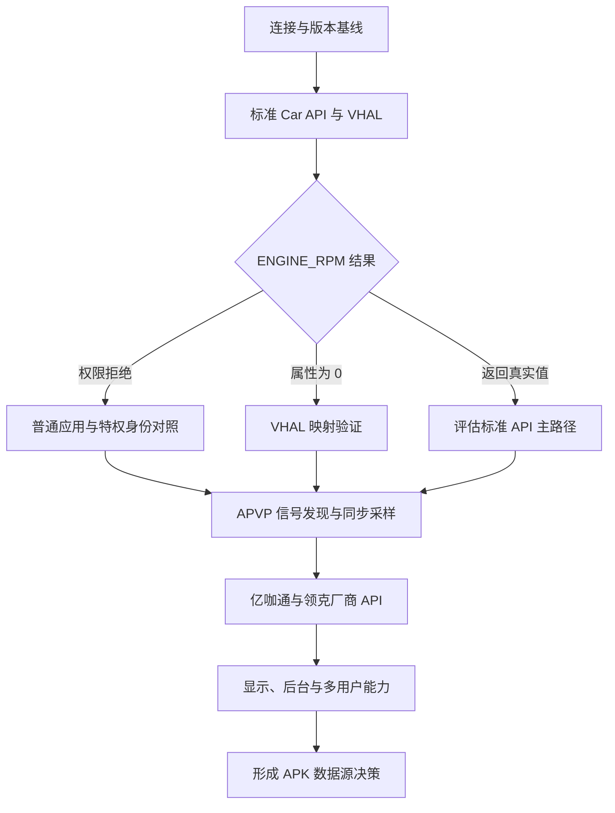

# 车机数据定向采集与 RPM APK 完善计划

本文档规定后续通过 ADB 对领克 DX11 车机进行只读数据采集时的重点、顺序、证据保存方式和安全边界，用于判断标准 Car API、APVP 及亿咖通厂商接口的可用性，并为 `lynk-rpm-reader` 后续开发提供可复现依据。

> 状态：可执行计划；截至 2026-08-27，当前 ADB 未检测到在线车机。下一次连接后从“连接与基线”开始，不重复执行已经完成的大范围备份。

## 关键约束

- 默认只读取车机，不修改系统分区、车辆属性、服务配置或 APK 数据。
- 不通过 ADB 控制油门、挡位、灯光、车门、空调或其他车辆执行器。
- 发动机状态变化只能由用户在安全停车条件下手动完成。
- 不清空车机日志；使用短时间窗口或有限行数快照。
- 不复制账号、联系人、短信、导航历史、语音内容、密钥或令牌。
- 涉及 root 身份、启动临时辅助进程或扩大 `/data` 读取范围前，单独确认必要性和授权。
- 每次采集使用独立时间戳目录，并生成文件清单和 SHA-256。

## 已知基线

| 项目 | 已确认结果 | 证据 |
| --- | --- | --- |
| 车机系统 | Android 11，SDK 30 | 既有车机备份 `inventory` |
| 标准转速属性 | `ENGINE_RPM = 291504901 / 0x11600305` | [CarApiRpmClient.java](../rpmreader/src/main/java/com/lynk/rpmreader/CarApiRpmClient.java) |
| 标准属性权限 | `CAR_ENGINE_DETAILED` 为 `signature\|privileged` | [dumpsys_package.txt](../../backups/headunit_2901149a53300031_20260827_094929/inventory/dumpsys_package.txt) |
| RPM Reader 实际权限 | 获得 `CAR_POWERTRAIN`，未获得 `CAR_ENGINE_DETAILED` | 同上 |
| APVP 转速信号 | `EngNSafeEngN = 308282774 / 0x12600596`，VDDM、只读 | [dx11_cn_apvp_signal_config.json](../../lynk/dx11_cn_apvp_signal_config.json) |
| APVP 服务 | 本地 gRPC `40005` 读取、`40007` 配置和 `setReady` | [ApvpGrpcRpmClient.java](../rpmreader/src/main/java/com/lynk/rpmreader/ApvpGrpcRpmClient.java) |
| 旧版实测 | APVP 曾记录约 `1292–1303 RPM`，标准属性此前固定为 0 | [旧版 README](../../rpmreader/README.md) |
| 当前待确认 | 标准属性是受权限拦截，还是 VHAL 未接入真实转速 | 后续 P0 采集 |
| 当前待确认 | `0x12600597` 是否为目标车机新版本的实际 APVP ID | 后续 APVP 配置发现 |

## 执行总览



## 采集优先级

| 优先级 | 采集主题 | 要回答的问题 | 完成条件 |
| --- | --- | --- | --- |
| P0 | 标准 Car API/VHAL | `ENGINE_RPM` 是否存在、谁能读、是否为真实值 | 明确权限、属性配置和熄火/怠速值 |
| P0 | APVP 对照 | APVP 实际 ID、类型、状态和更新频率是否稳定 | 与标准属性在同一时间窗口完成对照 |
| P1 | 汽车框架文件 | 车机实际如何定义属性权限和服务映射 | 保存相关 APK/JAR/XML/VINTF 及哈希 |
| P1 | 亿咖通厂商 API | 是否有比 APVP 更正式的第三方只读接口 | 找到明确接口或形成不可用证据 |
| P2 | 运行可靠性 | 休眠、唤醒、多用户、前后台是否影响读取 | 覆盖关键生命周期状态 |
| P2 | 扩展车辆信号 | 后续 APK 可以安全读取哪些数据 | 建立信号目录和推荐数据源 |
| P2 | 多屏显示 | RPM 是否可稳定展示在目标 Display | 确认 Display ID、窗口限制和投屏服务 |

## 1. 建立连接与采集目录

### 目标

确认设备身份、版本和当前 Android 用户，并把本轮输出与既有备份隔离。

### 本机准备

以下 PowerShell 命令只在本机创建采集目录并查询设备：

```powershell
$adbExe = 'D:\AndroidWatch_ADB_ToolBox\adb\adb.exe'
$captureStamp = Get-Date -Format 'yyyyMMdd_HHmmss'
$captureRoot = "D:\evcc\backups\headunit_followup_$captureStamp"
New-Item -ItemType Directory -Path $captureRoot | Out-Null

& $adbExe devices -l |
    Tee-Object -FilePath (Join-Path $captureRoot 'adb_devices.txt')
```

如果没有显示 `device` 状态，停止后续步骤，先解决 USB、授权或网络 ADB 连接问题。

### 基线命令

```powershell
& $adbExe shell getprop |
    Set-Content -LiteralPath (Join-Path $captureRoot 'getprop.txt') -Encoding utf8

& $adbExe shell 'id; whoami; getenforce; am get-current-user; uptime' |
    Set-Content -LiteralPath (Join-Path $captureRoot 'runtime_identity.txt') -Encoding utf8

& $adbExe shell 'pm list users; wm size; wm density' |
    Set-Content -LiteralPath (Join-Path $captureRoot 'users_display_baseline.txt') -Encoding utf8
```

### 停止条件

- 序列号与既有车机不一致。
- 设备状态为 `unauthorized`、`offline` 或空列表。
- 当前车辆状态不适合进行静态读取或用户无法确认车辆安全停放。

## 2. 验证标准 Car API 和 VHAL

这是下一轮采集的最高优先级。

### 采集服务和属性配置

```powershell
& $adbExe shell dumpsys car_service |
    Set-Content -LiteralPath (Join-Path $captureRoot 'dumpsys_car_service.txt') -Encoding utf8

& $adbExe shell dumpsys package com.android.car |
    Set-Content -LiteralPath (Join-Path $captureRoot 'package_com.android.car.txt') -Encoding utf8

& $adbExe shell dumpsys package com.lynk.rpmreader |
    Set-Content -LiteralPath (Join-Path $captureRoot 'package_com.lynk.rpmreader.txt') -Encoding utf8

& $adbExe shell service list |
    Set-Content -LiteralPath (Join-Path $captureRoot 'service_list.txt') -Encoding utf8

& $adbExe shell cmd -l |
    Set-Content -LiteralPath (Join-Path $captureRoot 'cmd_services.txt') -Encoding utf8

& $adbExe shell lshal |
    Set-Content -LiteralPath (Join-Path $captureRoot 'lshal.txt') -Encoding utf8
```

`lshal` 在部分版本可能只向 root 或 shell 暴露有限信息；命令失败也应保留错误输出，作为权限证据。

### 必须确认的字段

- `0x11600305` 或 `291504901` 是否出现在属性配置中。
- 属性类型是否为 Float。
- area 是否为 global/0。
- change mode 是否为 continuous。
- 支持的最小、最大采样率。
- 当前值的 status、timestamp 和 value。
- 普通 APK 调用时是否出现 `SecurityException` 或权限拒绝。
- `CAR_ENGINE_DETAILED` 是否出现在应用的实际 granted permissions 中。

### 判定规则

| 观察结果 | 判断 | 后续方向 |
| --- | --- | --- |
| 属性配置中不存在 `ENGINE_RPM` | 标准 VHAL 未提供该属性 | APVP 作为主路径 |
| 属性存在，普通 APK 报权限拒绝 | 接口存在但第三方权限不足 | 评估平台签名、特权安装或厂商代理 API |
| 属性存在且普通 APK读取为 0 | 可能是权限返回、状态无效或映射缺失 | 检查 status，并与 APVP 同步对照 |
| 特权身份读取真实值，普通 APK失败 | 主要是身份/权限问题 | 标准 API 只适用于系统集成版本 |
| 特权身份同样固定为 0 | VHAL 很可能未映射真实转速 | 不把标准 API 作为主数据源 |
| 普通 APK可读取真实值 | 标准 API 可成为主路径 | 改为 callback 订阅并保留 APVP 后备 |

## 3. 进行 APVP 同步对照

### 目标

确认实际车机版本使用的 `EngNSafeEngN` ID，并与标准 `ENGINE_RPM` 在相同车辆状态下比较。

### 采集进程和端口

```powershell
& $adbExe shell ps -A |
    Set-Content -LiteralPath (Join-Path $captureRoot 'processes.txt') -Encoding utf8

& $adbExe shell ss -lntp |
    Set-Content -LiteralPath (Join-Path $captureRoot 'tcp_listeners.txt') -Encoding utf8
```

重点检查：

- `localhost:40005`
- `localhost:40007`
- 端口对应的进程、UID 和启动来源
- `getAllTransfer` 返回的 transfer 列表
- `getTransferSignalConfig` 中名称为 `EngNSafeEngN` 的完整配置
- `setReady` 前后 value/status 的变化
- `readSignal` 响应中的实际 ID，而不是只检查代码内硬编码 ID

### 状态对照

| 采样状态 | 用户操作 | 标准 Car API | APVP | 目的 |
| --- | --- | --- | --- | --- |
| 熄火 | 车辆保持安全停放和熄火 | 记录 value/status | 记录 value/mode/ID | 建立零值基线 |
| 通电未启动 | 用户手动切换电源状态 | 同上 | 同上 | 区分系统在线与发动机运行 |
| 正常怠速 | 用户手动启动车辆并保持 P 挡 | 同上 | 同上 | 验证真实 RPM |
| 可选轻微变化 | 仅在用户确认安全且主动操作时 | 同上 | 同上 | 比较响应速度和缩放关系 |

如果不具备安全条件，只采集熄火和正常怠速，不需要为了测试主动改变转速。

### 短窗口日志

不清空车机日志，只提取有限行数：

```powershell
& $adbExe logcat -b all -d -v threadtime -t 5000 |
    Set-Content -LiteralPath (Join-Path $captureRoot 'logcat_recent_5000.txt') -Encoding utf8

Get-Content -LiteralPath (Join-Path $captureRoot 'logcat_recent_5000.txt') |
    Select-String -Pattern 'RpmReader|ENGINE_RPM|EngNSafeEngN|CarProperty|VehicleHal|APVP|SecurityException' |
    Set-Content -LiteralPath (Join-Path $captureRoot 'logcat_rpm_filtered.txt') -Encoding utf8
```

## 4. 定向复制汽车框架文件

先查询真实安装路径，再逐个复制；不要假设不同固件中的系统路径相同。

### 查询目标包路径

```powershell
$vehiclePackages = @(
    'com.android.car',
    'com.ecarx.eas.carservice',
    'com.ecarx.sdk.openapi',
    'com.ecarx.dfe.service',
    'com.flyme.auto.carservice'
)

foreach ($vehiclePackage in $vehiclePackages) {
    "PACKAGE=$vehiclePackage"
    & $adbExe shell pm path $vehiclePackage
} | Set-Content -LiteralPath (Join-Path $captureRoot 'vehicle_package_paths.txt') -Encoding utf8
```

### 复制顺序

1. 包清单中确认存在的 APK。
2. `android.car.jar` 和 Car Service 相关 JAR/APK。
3. `/system/etc/permissions` 中汽车权限 XML。
4. `/system/etc/permissions`、`/system/etc/sysconfig` 中相关特权白名单。
5. `/vendor/etc/vintf`、`/system/etc/vintf` 中 Vehicle HAL 声明。
6. APVP signal 配置及 protobuf/AIDL/JAR。
7. 只有静态分析仍缺证据时，才追加 OAT/VDEX 或 native 库。

实际执行 `adb pull` 前，应先检查每个绝对路径、目标大小和内容类型；确认后按文件逐个复制到本轮目录，禁止对 `/system`、`/vendor` 或 `/data` 做无差别递归拉取。

## 5. 分析亿咖通和领克厂商 API

### 目标

判断是否存在比 APVP 更正式、允许普通第三方应用使用的只读车辆数据接口。

### 静态检查重点

- exported Service、Provider、Receiver 和绑定 action。
- AIDL/Binder 接口和客户端 SDK。
- RPM、engine speed、powertrain、VDDM 等关键字。
- 回调或订阅接口，而非只寻找轮询读取。
- 调用方签名、UID、包名白名单和自定义权限。
- 接口是否只在 `system` UID 或特权应用中可用。
- 不同 Android 用户下服务是否独立运行。

### 采用条件

厂商接口只有同时满足以下条件，才应优先于 APVP：

- 明确提供只读 RPM。
- 普通安装 APK 可以取得所需权限或完成合法绑定。
- 数据在实车怠速状态下得到验证。
- 接口具备稳定的版本或能力发现机制。
- 不依赖 root、内存读取或直接 CAN 帧解析。

## 6. 验证运行可靠性和显示能力

在转速数据源确定后执行，避免显示问题与数据问题相互干扰。

### 生命周期场景

- APK 首次启动和再次启动。
- 前台切后台、后台回前台。
- 车机休眠和唤醒。
- APVP/Car Service 暂时不可用后的恢复。
- Android 用户 0、10、11 的安装和运行差异。
- 网络变化对 localhost gRPC 的影响。

### 显示场景

- `dumpsys display` 中全部 Display ID 和类型。
- `dumpsys window` 中目标 Activity 的 display、windowing mode 和限制。
- `com.ecarx.dfe.service` 的投屏/副屏能力与权限。
- 主屏与副屏切换后 RPM 数据线程是否保持单实例。

```powershell
& $adbExe shell dumpsys display |
    Set-Content -LiteralPath (Join-Path $captureRoot 'dumpsys_display.txt') -Encoding utf8

& $adbExe shell dumpsys window |
    Set-Content -LiteralPath (Join-Path $captureRoot 'dumpsys_window.txt') -Encoding utf8

& $adbExe shell dumpsys activity processes |
    Set-Content -LiteralPath (Join-Path $captureRoot 'dumpsys_activity_processes.txt') -Encoding utf8
```

## 7. 扩展车辆信号目录

RPM 主链路完成后，再按使用价值依次调查：

1. 车速。
2. 挡位。
3. 发动机/电机运行状态。
4. 冷却液温度。
5. SOC、电池功率和充放电状态。
6. 驾驶模式。
7. 车门、灯光等只读状态。

每个信号使用以下记录字段：

| 字段 | 说明 |
| --- | --- |
| 功能名称 | 用户可理解的名称 |
| 标准属性 | `VehiclePropertyIds` 名称、十进制和十六进制 ID |
| 厂商信号 | APVP/XSF 名称、ID 和模块 |
| 类型与单位 | Float/Int/Boolean、RPM、m/s、℃ 等 |
| area | global、seat、wheel 等 |
| 权限 | 声明权限和实际 granted 状态 |
| 普通 APK | 是否可读及错误表现 |
| 特权身份 | 是否可读及与普通 APK 的差异 |
| 实车证据 | 状态、时间、value、status/mode |
| 推荐数据源 | 标准 Car API、厂商 API、APVP 或不采用 |

## 证据、判断与开发路径

### Evidence

#### E-001

- 标题：车机将 `CAR_ENGINE_DETAILED` 定义为特权权限。
- 来源类型：file。
- 来源：[dumpsys_package.txt](../../backups/headunit_2901149a53300031_20260827_094929/inventory/dumpsys_package.txt)。
- 关键观察：权限保护级别为 `signature|privileged`。
- 复现方式：下一次连接后执行 `adb shell dumpsys package com.android.car` 和 `adb shell dumpsys package com.lynk.rpmreader`。

#### E-002

- 标题：当前 RPM Reader 未实际获得 `CAR_ENGINE_DETAILED`。
- 来源类型：file。
- 来源：同 E-001。
- 关键观察：安装权限中仅见 `INTERNET`、`CAR_POWERTRAIN`、`ACCESS_NETWORK_STATE`。
- 复现方式：执行 `adb shell dumpsys package com.lynk.rpmreader`。

#### E-003

- 标题：车机配置存在只读 APVP 转速信号。
- 来源类型：file。
- 来源：[dx11_cn_apvp_signal_config.json](../../lynk/dx11_cn_apvp_signal_config.json)。
- 关键观察：`EngNSafeEngN`、`308282774`、`VDDM`、`readOnly=true`。
- 复现方式：下一轮从实际车机 transfer 配置重新发现名称和 ID。

#### E-004

- 标题：应用没有进程内存读取逻辑。
- 来源类型：source review。
- 来源：[ApvpGrpcRpmClient.java](../rpmreader/src/main/java/com/lynk/rpmreader/ApvpGrpcRpmClient.java) 和 [CarApiRpmClient.java](../rpmreader/src/main/java/com/lynk/rpmreader/CarApiRpmClient.java)。
- 关键观察：读取路径分别为 localhost gRPC 和 `CarPropertyManager.getProperty()`。
- 复现方式：搜索 `/dev/mem`、`/proc/*/mem`、`ptrace`、JNI/native memory API。

### Findings

#### F-001：标准 RPM 属性对普通 APK 存在权限障碍

- 状态：已验证。
- 置信度：高。
- 证据：E-001、E-002。
- 影响：Manifest 声明本身不能让侧载 APK 读取标准 `ENGINE_RPM`。
- 后续：验证特权身份读取结果，区分纯权限问题与 VHAL 映射问题。

#### F-002：APVP ID 是信号标识而非内存地址

- 状态：已验证。
- 置信度：高。
- 证据：E-003、E-004。
- 影响：APVP 当前是无 root、只读、本地读取真实转速的已知可行路径。
- 后续：把信号名称发现、实际 ID 和版本兼容性纳入动态验证。

#### F-003：标准 VHAL 是否映射真实 RPM 尚未完成验证

- 状态：候选判断。
- 置信度：中。
- 证据：旧版实测记录及 E-001、E-002。
- 影响：如果特权身份也只能读取 0，则标准 API 不适合作为当前固件的主数据源。
- 后续：完成熄火/怠速、普通/特权身份、标准/APVP 四组对照。

### Path P-001：RPM 数据源决策路径

1. 从 `car_service` 获取 `ENGINE_RPM` property config，关联 E-001。
2. 用普通 RPM Reader 读取并记录 value/status/exception，关联 E-002。
3. 在单独授权后用特权身份读取同一属性，验证 F-003。
4. 同时发现并读取 APVP `EngNSafeEngN`，关联 E-003。
5. 在熄火和怠速状态下对齐时间并比较两路结果。
6. 根据判定表选择标准 Car API、厂商正式 API 或 APVP 作为主路径。
7. 保留另一条已验证路径作为受控后备，不引入内存读取和直接 CAN 解析。

## 采集结果目录结构

每轮目录保持以下结构；不存在的数据类型可以省略对应子目录：

```text
headunit_followup_YYYYMMDD_HHMMSS/
├── adb_devices.txt
├── getprop.txt
├── runtime_identity.txt
├── users_display_baseline.txt
├── car/
│   ├── dumpsys_car_service.txt
│   ├── package_com.android.car.txt
│   └── property_rpm_observations.csv
├── apvp/
│   ├── transfer_list.txt
│   ├── EngNSafeEngN_config.json
│   └── rpm_observations.csv
├── packages/
│   ├── vehicle_package_paths.txt
│   └── copied_files/
├── runtime/
│   ├── logcat_recent_5000.txt
│   ├── logcat_rpm_filtered.txt
│   ├── processes.txt
│   └── tcp_listeners.txt
├── display/
│   ├── dumpsys_display.txt
│   └── dumpsys_window.txt
├── inventory.csv
└── sha256.txt
```

`YYYYMMDD_HHMMSS` 表示由脚本自动生成的实际时间戳，不是需要手工创建的固定目录名。

## 完成本轮采集后的校验

```powershell
Get-ChildItem -LiteralPath $captureRoot -File -Recurse |
    ForEach-Object {
        $relativePath = $_.FullName.Substring($captureRoot.Length + 1)
        $fileHash = Get-FileHash -LiteralPath $_.FullName -Algorithm SHA256
        [PSCustomObject]@{
            Path = $relativePath
            Length = $_.Length
            SHA256 = $fileHash.Hash
        }
    } |
    Export-Csv -LiteralPath (Join-Path $captureRoot 'inventory.csv') -NoTypeInformation -Encoding utf8
```

本轮只有同时满足以下条件才算完成：

- 保存设备、版本、用户和车辆状态基线。
- 明确 `ENGINE_RPM` 是否存在及其 property config。
- 保存普通 APK 的权限和读取结果。
- 保存 APVP 实际信号 ID、配置和读取结果。
- 至少完成熄火与怠速两种状态的同步比较；不具备安全条件时，在报告中明确只完成熄火状态。
- 所有复制文件有来源路径、大小和 SHA-256。
- 给出 APK 主数据源、后备数据源和不采用方案的明确结论。

## 下一次连接后的最短执行清单

1. 确认 `adb devices -l` 显示目标车机为 `device`。
2. 创建新的时间戳采集目录。
3. 保存系统、用户和车辆状态基线。
4. 采集 `dumpsys car_service`、相关包权限和 Vehicle HAL 清单。
5. 启动 RPM Reader，保存普通应用读取日志。
6. 发现 APVP transfer、`EngNSafeEngN` 实际 ID，并保存同步数据。
7. 在安全条件下完成熄火和正常怠速对照。
8. 根据结果决定是否需要单独授权特权身份验证。
9. 查询并定向复制 Car Service、亿咖通和 Flyme Auto 相关 APK/JAR/XML。
10. 生成文件清单和 SHA-256，更新本报告的 Evidence、Findings 和最终数据源决策。
